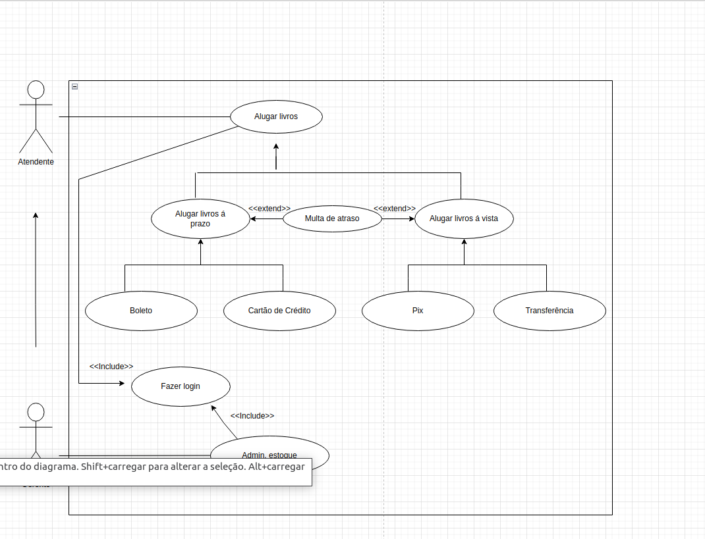
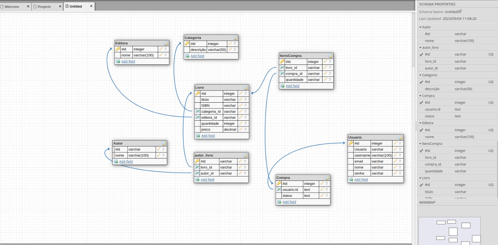

# Projeto Integrador - BooksMatch Locação de Livros

Um modelo para o desenvolvimento do Projeto Integrador do Curso de Técnico em Desenvolvimento de Sistemas para a Internet Integrado ao Ensino Médio do IFC - Campus Araquari.

- Professores: [Marco André Mendes](github.com/marcoandre) e [Alann Perini](https://github.com/AlannKPerini).
- Alunas: [Amanda Pires](https://github.com/AmandaPires17) e [Mariana Farias](https://github.com/Mariana-Fariass).

Links do projeto:

- [Documentação (esse documento)](github.com/marcoandre/pi-modelo)
- [Backend](github.com/marcoandre/pi-backend)
- [Frontend](github.com/marcoandre/pi-frontend)

# Situação Problema

<!--  -->

A BooksMatch foi fundada no ano de 2021 pelas alunas Amanda e Mariana do Instituto Federal Catarinense, Campus Araquari. Seu foco está no diferencial de fazer grupos de conversa, para os leitores interagirem entre si sobre seus livros preferidos. 

Atualmente, nossa biblioteca é dividida por corredores, com prateleiras organizando os livros por categorias. 

Após o cliente fazer a escolha do seu livro, iniciamos o processo de locação que atualmente consiste em anotar em uma agenda física os dados do cliente, como: nome, endereço, email e telefone; e os dados do livro locado, como: nome, data de locação e devolução, número de série e seção.

Para efetuar o pagamento, o cliente tem as opções dinheiro, pix ou cartão (débito/crédito). Caso haja atraso na devolução do livro, cobramos uma taxa que o cliente precisa pagar antes de alugar o próximo livro.

# Descrição da proposta

O foco de ação do BooksMatch é a locação de livros. Apenas as proprietárias têm acesso a administração do sistema, mas qualquer usuario cadastrado pode navegar no site. O site permitirá a escolha, seleção e pagamento de livros, como também acesso ao chat para conversas entre os usuários.

Um dos primeiros problemas que nosso software irá resolver é o da agenda. Uma agenda física não é eficiente, já que pode facilmente rasgar, molhar ou ser perdida. Já o nosso sistema poderá ser acessado de qualquer dispositivo, evitando problemas como a perda de dados. 

Será também uma vantagem do site poder encontrar com mais facilidade e economia de tempo o livro desejado de acordo com os gostos do cliente/usuário, usando filtros de gênero, categoria, autor, etc. 

O sistema gerará automaticamente a multa de atraso, que ficará disponível para visualização no perfil do usuário, evitando erros na contagem, que pode acontecer facilmente quando feita manualmente. 

# Regras de negócio

- **RN01 - Cadastro:** Para navegar no site o usuário deve ser previamente cadastrado.
- **RN02 - Locação do livro:** Para fazer a locação, é necessário que pelo menos um livro seja selecionado.
- **RN03 - Realizar Locação:** Para realizar a locação, apenas leitores com cadastro e nenhuma multa em aberto.
- **RN04 - Registro de Locação:** Os proprietários devem possuir acesso aos registros de locação.
- **RN05 – Pagamento de Multa:** O leitor que passar de 15 dias com o livro deverá pagar a multa de um real por dia de atraso.
- **RN06 - Quantidade máxima:** O usuário poderá locar no máximo 2 livros por vez.
- **RN07 – Relatório de Fluxo de Caixa:** O relatório de fluxo de caixa será permitido somente para os administradores.

# Requisitos funcionais RF

**ENTRADA**

- **R. F.  01 - Registro de Usuário:** O sistema deve permitir o registro do usuário, criando um perfil para tal, e o direcionando para a página inicial.
   - **Dados necessários:** Nome, email e senha.
   - **Usuários:** Todos os níveis de usuário.
- **- R. F.  02 - Registro de Livros:** O sistema deve permitir registrar livros.
   - **Dados necessários:** Nome, número de série, gênero, categoria, editora e quantidade.
   - **Usuários:** Apenas os administradores.

**PROCESSAMENTO**

- **R. F.  03 - Autenticação de usuário:** O sistema deve permitir autenticar o acesso ao sistema, verificando se o usuário pode acessá-lo e, caso possa, o direcionando para a página principal de seu perfil de acesso.
   - **Dados necessários:** Login, senha e nível de permissão.
   - **Usuários:** Todos os níveis de usuário.
- **R. F.  04 - Multa:** O sistema deve calcular a multa de acordo com os dias de atraso.
   - **Dados necessários:** Data de locação e devolução. 
   - **Usuário:** Todos usuários.
- **R. F.  05 - Pagamento:** Permitir que o usuário realize o pagamento via pix ou cartão de crédito/débito.
   - **Dados necessários:** Número do cartão, opção de pagamento, validade do cartão e senha.
   - **Usuário:** Todos os usuários.

**SAÍDA**

- **R. F.  06 - Relatórios de livros:** O sistema deve permitir a emissão de relatórios semanais dos livros locados.
   - **Dados necessários:** Nome do livro, data de locação e devolução, valor e caso houver, multa de atraso.
   - **Usuários:** Apenas administradores.
- **R. F.  07 - Finanças:** O sistema deve permitir relatórios mensais de entrada e saída das finanças. 
   - **Dados necessários:** Valores de entrada e saída
   - **Usuário:** Apenas administradores

# Requisitos não funcionais RNF

**RNF 01 - Navegador:** O sistema deverá ser compatível com o Google Chrome, Microsoft Edge, Opera e Firefox.

**RNF02 - Disponibilidade:** O sistema deverá estar disponível 24 horas por dia, 6 dias por semana, com 1 dia de manutenção.

**RNF03 - Segurança:** O sistema deverá ser seguro, evitando que dados sensíveis dos clientes sejam expostos a terceiros.

**RNF04 - Responsividade:** O sistema deverá ser responsivo, permitindo que os clientes acessem a loja online de qualquer dispositivo, como computadores, tablets e smartphones.

**RNF05 - Desempenho:** O software deve ser capaz de processar um número considerado de acessos simultaneamente sem diminuir significativamente o desempenho.

**RNF06 - Manutenção:** O software deve ser facilmente mantido e atualizado, permitindo que os desenvolvedores adicionem novos recursos, a manutenção será feita 1 vez por semana.

**RNF07 - Tecnologia Front-end:** Para a exibição em front-end, o software utilizará o CSS3 e o HTML5, além do framework VueJS.

**RNF08 - Tecnologia Back-end:** O software será desenvolvido utilizando o framework Django com o Django Res Framework.

**RNF09 - Autenticação:** Para realizar o acesso ao sistema é necessário ter um usuário de autenticação criado pelo administrador, além da possibilidade de solicitar um envio de redefinição de senha.

**RNF10 - Interoperabilidade:** O banco de dados utilizado será o MySQL.

**RNF11 - Tecnologia Mobile:** Para o desenvolvimento para smartphones, será utilizado o framework React Native.

# Casos De Uso

